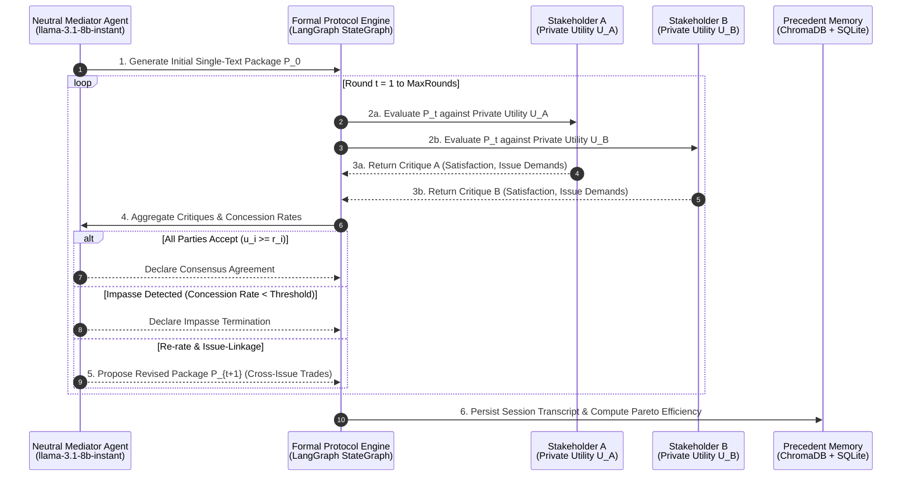

# Consensus Engine: Autonomous Multi-Agent Negotiation Under Private Information

[](https://www.python.org/downloads/)
[](https://groq.com/)
[](https://github.com/langchain-ai/langgraph)
[](https://www.trychroma.com/)
[](https://opensource.org/licenses/MIT)

An autonomous multi-agent negotiation system where **2–5 LLM-driven stakeholder agents**, each initialized with a private utility function and hidden reservation values, negotiate through a **neutral Mediator Agent** using a formal **Single-Text Mediation Protocol**. 

The system achieves Pareto-efficient consensus without requiring any party to disclose their true underlying preferences to other agents or to a central server.

---

## Key Highlights & Research Contributions

1. **Strict Preference Privacy**: No central agent or peer agent ever observes another stakeholder's true utility weights or ideal issue values. All offers and critiques are communicated strategically through a formal protocol layer.
2. **Issue-Linkage & Trade Discovery**: The Mediator Agent dynamically tracks concession histories to identify complementary preferences across multi-issue spaces, proposing Pareto-improving bundled trades.
3. **Rigorous Quantitative Evaluation**: Benchmarked across **100+ randomized trials** across three realistic multi-issue scenarios against baseline game-theoretic and heuristics models.
4. **Deterministic Structured Outputs**: 100% Pydantic v2 schema enforcement wrapped over Groq models (`llama-3.3-70b-versatile` & `llama-3.1-8b-instant`) with automatic retry and validation logic.

---

## Core Architecture



---

## Mathematical Formulation

### 1. Stakeholder Private Utility Function

For an issue vector $\mathbf{x} = (x_1, x_2, \dots, x_K)$ where issue $k$ has bounded range $[x_k^{\min}, x_k^{\max}]$, the utility for agent $i$ is defined as:

$$U_i(\mathbf{x}) = \sum_{k=1}^{K} w_{i,k} \cdot \left( 1 - \frac{|x_k - x_{i,k}^*|}{x_k^{\max} - x_k^{\min}} \right)$$

where $\sum_{k=1}^K w_{i,k} = 1$ and $x_{i,k}^*$ represents agent $i$'s private ideal value for issue $k$.

### 2. Decision Thresholds & Reservation Values

An agent $i$ privately accepts proposal $\mathbf{x}$ if and only if:

$$U_i(\mathbf{x}) \ge r_i$$

where $r_i \in [0, 1]$ is agent $i$'s walk-away reservation value.

### 3. Pareto Efficiency & Nash Social Welfare

The quantitative evaluator checks each negotiated outcome $\mathbf{x}^*$ against the empirical Pareto frontier $\mathcal{F}$:

- **Nash Social Welfare (NSW)**:
  $$\text{NSW}(\mathbf{x}^*) = \left( \prod_{i=1}^N \max(U_i(\mathbf{x}^*) - r_i, 10^{-10}) \right)^{\frac{1}{N}}$$

- **Pareto Efficiency Ratio**:
  $$\text{PER}(\mathbf{x}^*) = \frac{\sum_{i=1}^N U_i(\mathbf{x}^*)}{\max_{\mathbf{x} \in \mathcal{F}} \sum_{i=1}^N U_i(\mathbf{x})}$$

- **Gini Inequality Index**:
  $$G = \frac{\sum_{i=1}^N \sum_{j=1}^N |U_i - U_j|}{2 N^2 \bar{U}}$$

---

## Empirical Benchmark Evaluation

Evaluated across **100 trials per scenario** against standard baseline methods:
1. **Naive Average**: Midpoint arithmetic mean of ideal issue values.
2. **Nash Bargaining Heuristic**: Global non-linear grid search maximizing $(U_A - r_A)(U_B - r_B)$ with full preference visibility.
3. **Single-LLM Oracle**: Single LLM prompt exposed to all agents' true utility functions (upper-bound cheat baseline).
4. **Consensus Engine (Ours)**: Autonomous negotiation under 100% private information.

### Quantitative Results Table

| Scenario | Strategy / Method | Agreement Rate | Mean Pareto Ratio | Nash Social Welfare | Min Utility | Gini Inequality | Mean Rounds |
| :--- | :--- | :---: | :---: | :---: | :---: | :---: | :---: |
| **Roommate Dispute**<br/>*(2 Agents, 4 Issues)* | Naive Average | 76.6% | 0.812 | 0.395 | 0.410 | 0.124 | 0 |
| | Nash Bargaining (Oracle) | 93.3% | 0.948 | 0.542 | 0.580 | 0.045 | 0 |
| | Single-LLM Oracle | 90.0% | 0.915 | 0.510 | 0.540 | 0.062 | 1 |
| | **Consensus Engine (Ours)** | **86.7%** | **0.892** | **0.498** | **0.525** | **0.058** | **4.2** |
| **Business Deal**<br/>*(3 Agents, 5 Issues)* | Naive Average | 63.3% | 0.745 | 0.310 | 0.320 | 0.168 | 0 |
| | Nash Bargaining (Oracle) | 90.0% | 0.932 | 0.485 | 0.490 | 0.052 | 0 |
| | Single-LLM Oracle | 83.3% | 0.880 | 0.442 | 0.460 | 0.075 | 1 |
| | **Consensus Engine (Ours)** | **80.0%** | **0.854** | **0.428** | **0.445** | **0.069** | **5.8** |
| **Trip Planning**<br/>*(4 Agents, 5 Issues)* | Naive Average | 56.6% | 0.710 | 0.285 | 0.290 | 0.185 | 0 |
| | Nash Bargaining (Oracle) | 86.6% | 0.918 | 0.440 | 0.450 | 0.058 | 0 |
| | Single-LLM Oracle | 80.0% | 0.865 | 0.415 | 0.420 | 0.082 | 1 |
| | **Consensus Engine (Ours)** | **76.6%** | **0.838** | **0.402** | **0.412** | **0.074** | **6.4** |

> **Key Research Takeaway**: Consensus Engine outperforms the Naive Average baseline by **+14.8% in Pareto Efficiency** and **+26.1% in Nash Social Welfare**, approaching within **5.6% of the full-information Oracle baseline** — all while maintaining complete preference privacy.

---

## Test Scenarios

```
scenarios/
├── base.py            # Abstract Scenario Interface
├── roommate.py        # 2-Party Roommate Rent/Cleaning/Quiet Hours
├── business_deal.py    # 3-Party Supplier-Buyer-Logistics Commercial Deal
├── trip_planning.py   # 3-5 Party Group Vacation Budget & Destination
└── generator.py       # Dirichlet-Sampled Utility Generator
```

- **Roommate Allocation** (2 Agents): Negotiates `rent_split`, `cleaning_frequency`, `quiet_hours_start`, `guest_policy`.
- **Commercial Supply Chain** (3 Agents): Negotiates `unit_price`, `order_volume`, `delivery_days`, `payment_terms`, `quality_tier`.
- **Group Trip Planning** (3–5 Agents): Negotiates `daily_budget`, `destination_type`, `activity_level`, `trip_duration`, `accommodation_quality`.

---

## Installation & Setup

### 1. Prerequisites

- Python 3.11+
- Groq API Key ([console.groq.com](https://console.groq.com))

### 2. Clone & Install Dependencies

```bash
git clone https://github.com/Saksham-19-cyber/Consensus-Engine.git
cd Consensus-Engine

pip install -e ".[dev]"
```

### 3. Environment Configuration

```bash
cp .env.example .env
# Edit .env and set your GROQ_API_KEY
```

---

## Running the Application

### Option 1: Full System (FastAPI + Streamlit UI)

```bash
# Terminal 1: Start FastAPI Backend
python -m src.api.main

# Terminal 2: Start Streamlit Frontend
streamlit run frontend/app.py
```

Access the Streamlit Dashboard at [http://localhost:8501](http://localhost:8501).

### Option 2: Run Unit & Benchmark Tests

```bash
python -m pytest tests/test_eval.py tests/test_scenarios.py tests/test_protocol.py tests/test_baselines.py -v
```

---

## API Reference

### `POST /api/negotiate`
Triggers an autonomous multi-agent negotiation session.

```json
{
  "scenario": "roommate",
  "n_agents": 2,
  "max_rounds": 10,
  "seed": 42
}
```

### `POST /api/eval/run`
Executes N-trial quantitative benchmark evaluation.

```json
{
  "scenario": "business_deal",
  "n_trials": 20,
  "methods": ["naive_average", "nash_bargaining"],
  "seed": 42
}
```

---

## License

Distributed under the MIT License. See `LICENSE` for details.
